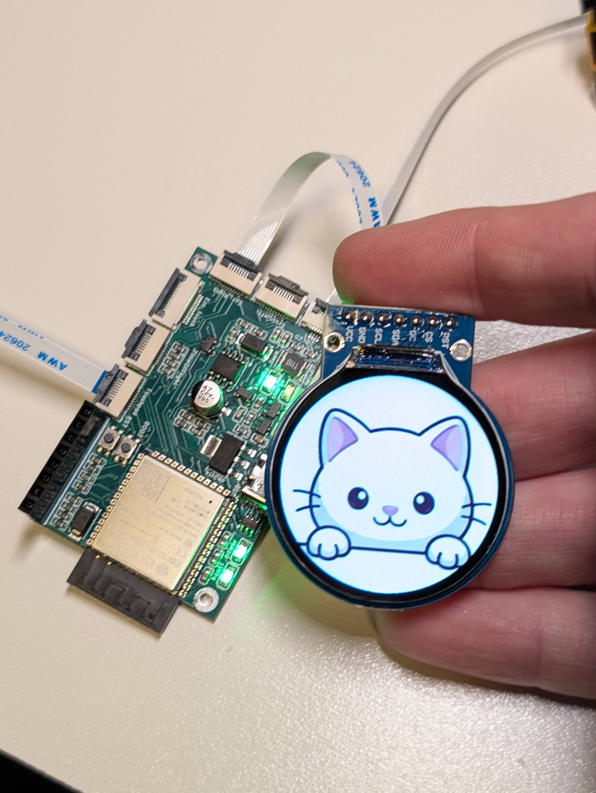

# Intellar Engine Firmware

> [!IMPORTANT]
> **Active Development:** This project is a work in progress. While the hardware is finalized, the firmware, drivers, and documentation are updated frequently.

  

Modular software platform for the **Intellar Ecosystem**, built on **ESP32-S3 (N8R8)** using the **PlatformIO** environment. This system uses a clean 0.5mm FFC ribbon-cable architecture to drive multiple displays and sensors.

Demo:

https://youtube.com/shorts/w5Q9UKIfWT0

https://youtube.com/shorts/v_g5v8qn-wk

---

### 🛠 Hardware Specifications
* **Core:** ESP32-S3-WROOM-1 (**8MB Flash / 8MB PSRAM**)
* **Wireless:** Native Wi-Fi & Bluetooth LE (BLE)
* **Interconnect:** 0.5mm FFC Satellite system
* **Power:** USB-C + Li-ion/LiPo charging with dual JST-PH 2.0mm ports (protected)

---

### 📂 Workspace Structure

| Folder | Description |
| :--- | :--- |
| **`/data`** | Binary assets (240x240 animations) |
| **`/src/Core`** | System state and core engine logic |
| **`/src/Drivers`** | Display abstraction (LCD, OLED, BLE) |
| **`/src/Interface`** | Animation logic (`RobotEye`) |
| **`/src/Sensors`** | Support for IMU, ToF, and Touchpad |
| **`/tools`** | Asset conversion scripts (`gui-image-tools.py`) |

---

### 🚀 Getting Started
1. **Environment:** Open the project in **VS Code** with the **PlatformIO** extension.
2. **Assets:** Use the scripts in `/tools` to prepare custom binary assets.
3. **Deploy:** Build and upload to the Intellar Engine via **USB-C**.

---

### 🔗 Resources
* **Documentation & News:** [intellar](https://www.intellar.ca/blog/intellar-engine-satellite-boards)
* **Hardware Kits:** [Intellar Store](https://intellar.square.site/)

---

<i>Pre-production phase development kit.</i>

