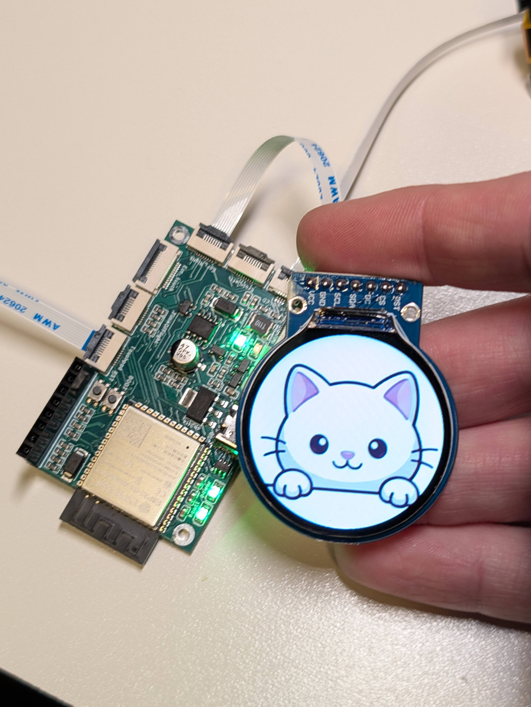

# Intellar Engine — Firmware

## Overview

**Intellar Engine** is the central compute board for the Intellar robotics / character platform: an **ESP32-S3** that drives round TFT “eyes”, an auxiliary flat display path, an OLED status strip, and satellite peripherals over a **flat-flex (FFC)** link. Bluetooth LE exposes telemetry and file-oriented control so a phone or a companion web dashboard can follow what the hardware is doing in real time.

**This repository** is the reference firmware: display bring-up (**LovyanGFX**), animation pipelines (strip assets on **LittleFS**), BLE services, touch surfaces (capacitive pads and, on the ILI9341 build, **XPT2046** stylus input), and optional IMU / ToF integration. The code is organised for someone who wants to **reproduce the stack**, **swap assets**, or **extend behaviours** without starting from a blank Arduino sketch.

If that matches your hardware revision or your research, clone the tree, open it in **PlatformIO**, choose the environment that fits your panel configuration (`gc9a01` vs `ili9341`), and flash. The sections below document layout, build targets, and where to adjust pins and touch mapping.

> **Note:** Behaviour and pin assignments evolve with PCB revisions. When upgrading, confirm `platformio.ini` and `src/` against your schematic before flashing.



## At a glance

| | |
| :--- | :--- |
| **MCU** | ESP32-S3, 8 MB flash, OPI PSRAM (board profile) |
| **Displays** | Dual **GC9A01** round SPI panels, or **ILI9341** + **XPT2046** (separate PlatformIO target) |
| **Human interface** | SSD1306 OLED, capacitive touchpad (`touchRead`), BLE GATT + optional web dashboard |
| **Sensors** | IMU, ToF (optional / board-dependent) |
| **Tooling** | PlatformIO; asset helpers under `tools/` |

## Hardware kits

If you want **hardware that matches this repository**—FFC layout, display options, and power path the firmware assumes—the **Intellar Engine** boards and kits are available from **[intellar.square.site](https://intellar.square.site/)**. That is usually the fastest path from reading the code to a board you can flash with the documented `gc9a01` / `ili9341` targets, without reconciling a generic devkit against our pin map.

Long-form context (satellite boards, revisions, and field notes) stays on the [Intellar blog](https://www.intellar.ca/blog/intellar-engine-satellite-boards); the store is the practical route when you are ready to **build on real hardware** rather than simulate it.

## Scope

- Dual round **GC9A01** displays (SPI), or a separate **ILI9341** flat panel with **XPT2046** resistive touch on the same SPI bus as the TFT (see `[env:ili9341]`).
- OLED (SSD1306), BLE GATT services, optional IMU / ToF, capacitive **touchpad** (ESP32 `touchRead`, not the ILI9341 stack).

## Hardware (reference)

| Item | Detail |
| :--- | :--- |
| MCU | ESP32-S3 (8 MB flash, OPI PSRAM as per board profile) |
| RF | Wi-Fi and Bluetooth LE (Arduino BLE stack) |
| Interconnect | Flat-flex (FFC) to satellite boards |
| Power | USB-C; Li-ion/LiPo path with protected outputs (see hardware docs) |

## Repository layout

| Path | Role |
| :--- | :--- |
| `data/` | LittleFS assets (e.g. 240×240 strip binaries) |
| `src/Core/` | Engine state, shared configuration |
| `src/Drivers/` | LCD (LovyanGFX: GC9A01 or ILI9341 + XPT2046), OLED, Bluetooth |
| `src/Interface/` | Eye animation, `RobotEye`, capacitive touchpad |
| `src/Sensors/` | IMU, ToF |
| `tools/` | Asset preparation (`gui-image-tools.py`, etc.) |

## Build and flash

Open the project in **VS Code** with the **PlatformIO** extension, or use the CLI from the repository root.

| Environment | When to use |
| :--- | :--- |
| `gc9a01` | Dual round GC9A01 (`SCREEN_GC9A01_DUAL`). No SPI XPT2046 profile in this target. |
| `ili9341` | ILI9341 + XPT2046 (`TOUCH_CS`). Uses `Panel_ILI9341`. **Do not** flash this image on a round-only GC9 assembly. |

```bash
git clone https://github.com/intellar/Intellar-Engine.git
cd Intellar-Engine
pio run -e gc9a01 -t upload
pio run -e ili9341 -t upload
pio run -e gc9a01 -t uploadfs    # LittleFS; use -e ili9341 if that is the active target
```

**Touch inputs:** BLE status and the companion dashboard distinguish (1) the **capacitive touchpad** from (2) the **ILI9341 / XPT2046** coordinate stream. For the current ILI9341 PCB, the firmware applies a default **X+Y mirror** after `getTouch()`; overrides (`ILI9341_TOUCH_*`) are listed under `[env:ili9341]` in `platformio.ini`.

## References

- [Engine / satellite boards — blog](https://www.intellar.ca/blog/intellar-engine-satellite-boards)
- [Kits & boards — Intellar store](https://intellar.square.site/) (same link as **Hardware kits** above)

## Recorded demos

- <https://youtube.com/shorts/w5Q9UKIfWT0>
- <https://youtube.com/shorts/v_g5v8qn-wk>
